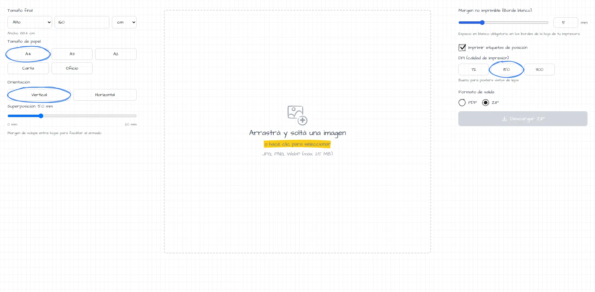

# Divisor de imágenes para impresión

Una aplicación web diseñada para dividir imágenes grandes en múltiples mosaicos (hojas) para su impresión física, manteniendo proporciones, márgenes y áreas de solapamiento. Desarrollada con un estilo visual "doodle/hand-drawn".



## Características Principales

- Carga de imágenes mediante drag-and-drop utilizando `react-dropzone`.
- Configuración personalizada de dimensiones finales, tamaño de papel (A4, A3, Carta, etc.) y orientación.
- Ajuste de márgenes de impresión y solapamiento (overlap) con líneas de guía.
- Interfaz con estética de dibujo a mano alzada implementando `rough-notation` y `wired-elements`.
- Exportación de la grilla final en formato PDF (usando `jspdf`) o como un archivo ZIP (usando `jszip` y `file-saver`) con las imágenes individuales.

## Tecnologías Utilizadas

- **Core:** React 18 y ReactDOM 18.
- **Build Tool:** Vite 5.
- **Estilos:** Tailwind CSS 4 con `@tailwindcss/vite`.
- **Generación de Archivos:** `jspdf` (v2.5.1), `jszip` (v3.10.1) y `file-saver` (v2.0.5).

## Requisitos Previos

- Node.js instalado en el entorno local.

## Instalación y Uso

1. Clonar el repositorio e instalar las dependencias:
   ```cmd
   npm install
   ```
2. Iniciar el servidor de desarrollo:

   ```cmd
   npm run dev
   ```

3. Construir la aplicación para producción:

   ```cmd
   npm run build
   ```

4. Previsualizar la construcción de producción:

   ```cmd
   npm run preview
   ```
